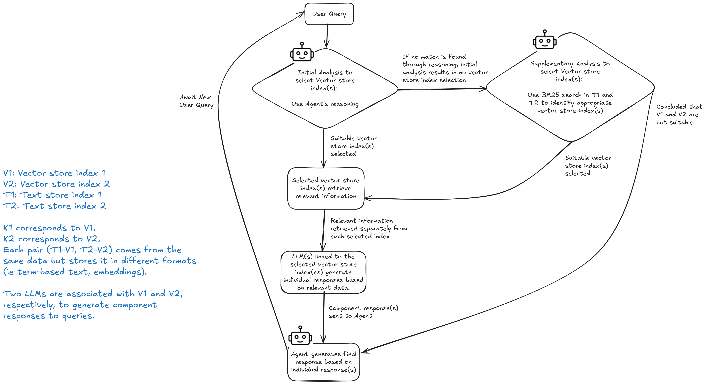

# Budget Chatbot 2024

## System Architecture

### RAG Architecture Overview


This diagram illustrates a structured Retrieval-Augmented Generation (RAG) architecture for processing user queries. It supports dynamic index selection, context retrieval, result re-ranking, and final response generation managed by an Agent.

### Data Preprocessing
<div style="text-align: center;">
    
</div>

1. **Source Documents**:
   - The primary input sources are PDF documents and web page.
   - PDFs include:
     - **Budget Debate Round-Up Speech**: [Link to Speech](https://www.mof.gov.sg/singaporebudget/budget-2024/budget-debate-round-up-speech)
       - File: `fy2024_budget_debate_round_up_speech.pdf`
     - **Budget Statement**: [Link to Statement](https://www.mof.gov.sg/singaporebudget/budget-2024/budget-statement)
       - File: `fy2024_budget_statement.pdf`
       - Includes all annexes from the Budget Statement web page
   - Web-scraped text is taken from web page:
     - **Support For Households**: [Link to Resource](https://www.mof.gov.sg/singaporebudget/resources/support-for-households)

2. **Transformation**:
   - Both document types are converted into markdown format using LlamaParse.

3. **Processed Documents**:
   - The parsed content is ready for the next phase: Chunking.

### RAG Architecture Components

1. **Processed Documents**:
   - Processed source documents, including PDFs and web-scraped text in markdown format, serve as the data input.
   - Processed PDFs will populate indices **V1** in **Vector Store**, and **K1** in **Text Store**
   - Processed web-scraped text will populate indices **V2** in **Vector Store**, and **K2** in **Text Store**
   - Scripts used for data preprocessing and index preparation:
     - `prepare_vector_keyword_indexes_1.py` to prepare indices **V1** and **K1**.
     - `prepare_vector_keyword_indexes_2.py` to prepare indices **V2** and **T2**.

2. **Embedding Model (OpenAI text-embedding-3-small)**:
   - Accessed via API, this model generates embeddings from the source documents.
   - The generated embeddings are stored in the Vector Store for retrieval based on vector similarity.

3. **Text Store (Term-Based)**:
   - Houses indices, **T1** and **T2**.
   - These indices are utilized by the Agent for term-based (BM25) retrieval.

4. **Vector Store (Chroma)**:
   - Serves as the primary data store, containing embeddings in indices **V1** and **V2**.
   - The **Agent** can dynamically choose to use either or both indices V1 and V2 based on query requirements and relevance.

5. **HyDE (Hypothetical Document Embeddings)**:
   - Uses the **Embedding Model** to generate hypothetical embeddings for transforming queries, enhancing matching in the Vector Store.
   - Transformed queries are used to search the vector store, improving the retrieval of contextually relevant results.

6. **ReRanker (Cohere rerank-english-v3.0)**:
   - Each vector store index has a dedicated ReRanker (accessed via API).
   - The use of ReRanker allows for more contextually relevant results to be retrieved from the Vector Store.
   - After results are retrieved from the Vector Store indices, the ReRanker reorders them to prioritize the most contextually relevant responses.
   - The re-ranked results are then sent to the LLM(s) associated with each selected vector store index.

7. **LLM (OpenAI gpt-4o-mini)**:
   - A dedicated LLM (accessed via API) is assigned to each vector store index.
   - Each LLM processes the re-ranked results and retrieves relevant context to generate a distinct component response based on the data from its respective index.
   - Each component response includes citations to the source data.
    - See CITATION_PROMPT_A, CITATION_PROMPT_B in `prompts.py` for prompts used.

8. **Agent (OpenAI gpt-4o)**:
   - Interacts with human user via a chat interface.
   - The Agent (based on LLM accessed via API) oversees response generation by:
     - Selecting the appropriate vector store index based on the transformed query.
     - Integrating component responses from the LLM.
     - Generating a final response based on individual component responses from each selected index.
   - The final response is sent back to the user.


## Agent-Driven RAG Workflow



This flowchart outlines a structured approach for dynamically selecting vector store index(es) through LLM-based reasoning (Initial Analysis) or term-based search (Supplementary Analysis). Once relevant information is retrieved separately from each selected index, the system generates distinct component responses for each index, which are then combined to form a final response to the user’s query.  

<span style="color:orange">

#### Agent-Driven Index Selection (Initial Analysis):

In the initial analysis phase, the agent relies on LLM reasoning to identify the appropriate vector store index(es) for retrieving relevant information. However, there are scenarios where the LLM's reasoning may fail to select the correct index(es). This can happen due to:
  
&nbsp;&nbsp;&nbsp;&nbsp;(a) Ambiguity or lack of clarity in the prompts.  
&nbsp;&nbsp;&nbsp;&nbsp;(b) Unfamiliar or unexpected user queries that the agent does not fully understand.

</span>


<span style="color:green">

####  BM25-Based Index Selection (Supplementary Analysis):
If the initial Agent-driven analysis doesn't select the correct index due to unclear or unfamiliar queries, this term-based search takes over.
- It uses a statistical method (BM25) to assess relevance within term-based indices T1 and T2. If relevant data is identified in these indices, this suggests that the corresponding vector store indices (V1 and V2) should be selected.
- This ensures that relevant information is still retrieved, and accurate responses are provided to the user, even when the Agent's reasoning doesn't work well.

</span>


### Agent-Controlled Dynamic Index Selection and Aggregation Process

1. **User Query Initiation**: The process starts when a query is submitted by the user.

2. **Agent-Driven Index Selection (Initial Analysis)**:
   - The system performs an initial analysis using LLM reasoning to determine the appropriate vector store index(es) to retrieve relevant information.
   - See AGENT_PROMPT in `prompts.py` for prompt used.
   - If suitable vector store index(es) are identified, the process moves forward to next step to retrieve relevant information from selected index(s).
   - **If no match is found** through LLM reasoning, no vector store index is selected in this step, and the process proceeds to the supplementary analysis.

3. **BM25-Based Index Selection (Supplementary Analysis)**:
   - If the initial analysis does not yield a suitable vector store index, a supplementary analysis is conducted.
   - This analysis involves a BM25 term-based search in indices T1 and T2, corresponding to vector store indices V1 and V2, respectively. BM25 is used to evaluate relevance in term-based indices T1 and T2, indicating the selection of vector store indices V1 and V2 if relevant data is found.
   - If suitable vector store index(es) are found, the process moves forward to retrieve relevant information from selected index(s).
   - If **both V1 and V2 are deemed unsuitable**, no vector store index is selected, and returns to Agent.

4. **Independent Retrieval from Selected Indices**:
   - Relevant information is initially retrieved separately from each selected index without consolidation, ensuring each index’s retrieved data remains independent.

5. **LLM Component Response Generation**:
   - LLM(s) associated with each selected vector store index generate distinct component responses based on the data retrieved from their respective indices.
   - Each component response includes citations to the source data.

6. **Component Responses Sent to Agent**:
   - The component responses generated by the LLM(s) are then sent to the Agent.

7. **Final Response Synthesis by Agent**:
   - The Agent synthesizes a final response by integrating the separate component responses from each selected index.

8. **System Reset and Await New Query**:
   - After the final response is generated, the system awaits for a new user query.

### Additional Information

- **Index Selection Options**:
  - **V1** and **V2** are two different vector store indices the Agent can select.
  - **T1** and **T2** are term-based stores linked to V1 and V2, respectively, offering an alternative representation (e.g., term-based text vs. embeddings) for the same underlying data.


## Additional Features Implemented

- User query responses include citations that link directly to the original sources.
    - Source A indicates the source of the data is from index V1.
    - Source B indicates the source of the data is from index V2.
    - Node ID is the identifier for the specific node/chunk in the vector store.


- Exploration of chunking strategies: [Colab Notebook](https://colab.research.google.com/drive/1SQAo4BsADWxzTBD-TJ8cmQypi5jx6MQ-?usp=sharing)
- Added streaming text effect for enhanced user experience.
- Deployed the Budget Chatbot 2024 on the cloud: <a href="https://bit.ly/3OaieNW" target="_blank">Demo</a>


## Quick Deployment Guide
Vector store and text store are already populated and ready for use in the docker container.  
There is no need to run `prepare_vector_keyword_indexes_1.py` and `prepare_vector_keyword_indexes_2.py` to populate the vector store and text store.

### Prerequisites
- Docker installed on your laptop
- API keys for OpenAI and Cohere

### Deployment Steps

1. **Create a Project Directory**
```bash
mkdir budget2024_sg
cd budget2024_sg
```

2. **Create Environment File**
```bash
# Create .env file
touch .env
```

Add the following to your `.env` file:
```bash
OPENAI_API_KEY=your-openai-key-here

# Used for Cohere Reranker
# https://dashboard.cohere.com/api-keys
COHERE_API_KEY=your-cohere-key-here

# Used for LlamaParse
# Necessary only if you intend to run prepare_vector_keyword_indexes_1.py or prepare_vector_keyword_indexes_2.py.
# https://docs.cloud.llamaindex.ai/llamacloud/getting_started/api_key
LLAMA_CLOUD_API_KEY=your-llama-cloud-key-here
```

3. **Pull and Run the Docker Container**
```bash
# Pull the image
docker pull edangx100/budget2024_sg

# Run the container
docker run -d \
  --name budget2024_sg \
  -p 8501:8501 \
  --env-file .env \
  edangx100/streamlit_test0
```

4. **Access the Application**
Open your web browser and navigate to:
```
http://localhost:8501
```

### Managing the Container

```bash
# Stop the container
docker stop budget2024_sg

# Start the container
docker start budget2024_sg

# Remove the container
docker rm budget2024_sg

# View logs
docker logs budget2024_sg

# View container status
docker ps -a | grep budget2024_sg
```

### Troubleshooting

1. **Port Conflict**: If port 8501 is already in use, modify the port mapping in the docker run command:
```bash
docker run -d -p 8502:8501 --env-file .env edangx100/budget2024_sg
